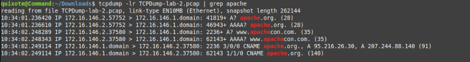
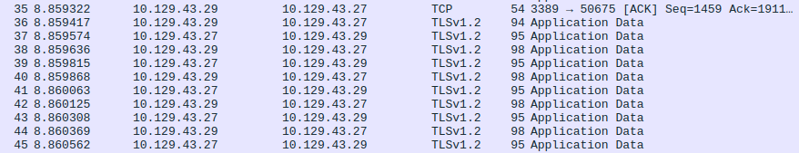

# Network Traffic Analysis Lab

## Objective

The Network Traffic Analysis Lab follows the Hack The Box Academy (HTBA) Introduction to Network Traffic Analysis module and was designed to strengthen both conceptual and practical understanding of computer networking and packet analysis. The primary focus was to examine both pre-existing Packet Capture (PCAP) files and live packet capture data (using both TCPDump and Wireshark) and extract valuable information about current and past network traffic flows, especially as they relate to cybersecurity. The key topics addressed were network security, network protocols (DNS, TCP/IP, HTTP/HTTPS, etc.), network attack patterns, and network forensics.

### Skills Learned

- Familiarity with network analysis tools like Wireshark and TCPDump
- Proficiency in analyzing and interpreting network traffic through Pack Captures.
- Ability to discover, isolate, and analyze suspicious network activity.
- Deepened knowledge of network protocols and security vulnerabilities.
- Development of critical thinking and problem-solving skills in cybersecurity.

### Tools Used

- Wireshark and TCPDump for intercepting and scrutinizing network traffic.
- XFreeRDP for remote host communication.

## Steps
As outlined in the Objective section, the structure of this lab follows the outline and promptings of the Hack The Box Academy Network Traffic Analysis module. The first thing asked of us by this module was to analyze a few PCAP files using the command line tool TCPDump, which does not provide a user interface, but outputs network traffic directly into the command line. To use this tool, one generally requires sudo privileges, as the tool needs direct access to the hardware via the network interfaces. In any case, we kicked things off by downloading both TCPDump and Wireshark (which was used in the second phase of the lab), to our personal Linux machine. We also downloaded the PCAP file (TCPDump-lab-2.PCAP) from the HTBA website.  
Once the tools required for the initial analysis were all assembled, we tested out the tool by opening the PCAP file using the -r flag, which instructs TCPDump to read data from a file:

    tcpdump -r ./TCPDump-lab-2.PCAP

(note, in contrast to what was mentioned previously, we did not need sudo privileges in this case because we were reading a file and did not need access to the system hardware). We were immediately flooded with a dizzying amount of data:

  

  *Ref. 1: An image of the initial PCAP capture outputted via TCPDump*

And so the journey had begun...

After spending a moment recovering from the data avalanche, we returned to the module to see where to go next, and were thus prompted to examine the caputre file and look at he types of traffic we might see. We did so, and observed that the first record in the file was from a client machine (using some high, ephemeral port number, 54940) reaching out to a server via HTTPS (port 443). The next line appeared to be a response, so perhaps this was a conversation between a web server and its client. 

A few lines down, we discovered some HTTP traffic (port 80), which was again likely a web server and client, but the traffic in this case was of course unencrypted. Further still, we were able to se some variation from the standard HTTP/HTTPS encoutnered so far. The client host in the previous traffic was observed reaching out to a new machine, this time using UDP instead of TCP and utilizing port 1337, which was a port not familiar to us at the time. Because 1337 was a mystery, we decided to do a little internet research, and discovered that one possibility was the Men&Mice DNS service. An additional piece of evidence that indicated DNS traffic is the fact that DNS typically utilizes UDP, which was the transmission protocol associated with this traffic. We therefore decided to tentatively label this conversation as some sort of DNS request/response. 

After concluding the initial examination of the traffic, we were prompted by the module to record the hosts involved in the traffic and the ports they utilized. We observed each of the following hosts
        
        172.16.146.2
        172.16.146.1
        server-13-35-106-128.mia3.r.cloudfront.net
        23.196.60.92

using the following ports

        53
        80
        443
        1337

The IP address 172.16.146.2 was acting as the client in all of the observed interactions, while the rest of the hosts seemed to be acting as servers. 

Next, we attempted to identify the very first *complete* TCP handshake in the file. To answer this question, it was best to first review what the TCP handshake looks like:

        127.0.0.1.12345 > 127.0.0.1.80:	Flags [S], seq ...
        127.0.0.1.80 > 127.0.0.1.12345:	Flags [S.], seq ...
        127.0.0.1.12345 > 127.0.0.1.80:	Flags [.], seq ...

First, there is the initial packet where in which one typically encoutners a client reaching out to a server with the SYN flag set-- [S]. After this, the server responds with both the SYN and ACK flags set-- [S.], indicating, on the one hand, that it has received the client's packet, and on the other, that it would like the client ot synchronize with its own responses. Finally, the client responds with its own ACK packet-- [.]. 

Because the file was rather long and messy, I used the -s and -c flags when searching for the first TCP handshake. These two flags limit the number of bytes included when outputting each packet and the number of packets included in the cli output, respectively.

        tcpdump -s 50 -c 100 -r TCPDump-lab-2.PCAP

After analyzing the output, I was able to discern that the first TCP handshake that occurs is between 172.16.146.2 (as the client) and static.30.26.216.clients.your-server.de (the server).

  

  *Ref. 2: An image of the PCAP capture after reducing the output, including the first TCP handshake*

How was this determination made, however? As the first piece of evidence, it was 172.16.146.2 that reached out first with the SYN packet. As far as I am aware, in almost all cases, it will be the client that initiates the connection to a server. After all, how often does one ever spontaneously receive requests from a webpage enticing us to view its resources? In addition, the port numbers also suggest this client-server configuration. The host with IP address 172.16.146.2 reaches out using a large ephemeral port number, while static.30.26.216.clients.your-server.de utilizes port 443, which is the archetypal port for HTTPS traffic, utilized by servers. As a final piece of evidence, the hostname of the suspected server actally contains the phrase 'your-server' as can be ascertained by visual observation. 

The HTBA module then informed us that there was some network traffic in the file containing a DNS request for apache.org, and prompts us to recover the IP address delivered by the DNS server. 

To answer this question, we used TCPDump's -l flag, which allows the user to pipe its output into different programs, the flag 'port 53', which filters for DNS traffic, and then piped the output of the command into the grep tool, searching for the string 'apache'. The final command was as follows:

        tcpdump -lr TCPDump-lab-2.pcap port 53 | grep apache

  

  *Ref. 3: The output of the tcpdump command, using the port and -l flags, and being piped into the grep command*

Thus, by examining the output of this command (specifically the A records we were able to see the output), we were able to recognize that there are two different servers hosting apache.org, 95.216.26.30 and 207.244.88.140.

After we had discovered this information, we moved onto the next segment of this module. Here, we were asked to find the DNS server for the network segment as well as what domain names were requested within the pcap file. To answer the first question, we simply applied a DNS display filter and observed which machine was acting as a server in the interactions. In this case, the server was 172.16.146.1, which indicated that this host was the DNS server for the network segment. Enumerating all of the domain names requested in the capture required a little bit more work. I applied several stages of filtration in the final command, ultimately using grep, cut, and uniq to get a more easily readable list. First, I tried simply filtering for port 53 and then grepping the output for the string 'A?', which indicates the client is requesting to resolve a domain into an IP address. The command looked like the following:

    tcpdump port 53 -lr TCPDump-lab-2.PCAP | grep -w 'A?'

where the -w flag instructs grep to look for exact matches. This however, produced a lot of extra output which was a little difficult to parse through. Hence, I refined the output further using the cut and uniq commands, to ensure each record was only included once. The final resultant command was

     tcpdump port 53 -lr TCPDump-lab-2.PCAP | grep -w 'A?' | cut -d ' ' -f 8 | uniq

which produced a very nice list containing each of the domain names requested from the DNS server in the capture.

  

  *Ref. 4: The list of domain names requested by the DNS client in the packet capture*

  

## Wireshark
The module now shifted gears, transitioning from the cli-based TCPDump to the GUI-based Wireshark. For this section of the module, a live capture and a virtual machine were used as the subject of the investigation, rather than a PCAP file. To access this machine, we needed to use a VPN to tie into the HTBA private network which was done using an OpenVPN file provide by the platform. The following commands established the VPN connection:

        sudo openvpn academy-regular.ovpn

We then needed to use an RDP client to connect to the specific machine in question, in this case, we will download and use XFreeRDP:

        sudo apt install freerdp2-x11
        xfreerdp /u:htb-student /p:*********** /v:***********

where /p is followed by the user's password, and /v is followed by the target host's IP address. Now, our analysis was able to begin. We opened Wireshark via the command line, and then used the Capture tab on the radial menu to select the ENS224 interface, subseuqently opening a capture session on this interface. 

After allowing the capture to run for a few minutes, we returned to the machine to look at the traffic that had been generated. The HTBA module pointed us towards examining the FTP traffic within the capture, and so this is where we focused our attention, using the string 'ftp' as a display filter to eliminate everything besides FTP traffic. Almost immediately, we were able to visually identify a few interesting details. Firstly, we noticed an anonymous login, which we know from our experience dabbling in penetration testing, is a major misconfiguration. This struck us as possibly malicious or suspicious traffic. 

  

  *Ref. 5: A snapshot of the suspicious FTP traffic, including the Anonymous login traffic*

Returning to the task directions, we were then asked to find and save to our host an image file that was transferred in this FTP exchange. Thus, we used Wireshark to follow the FTP conversation, and were able to discover a file which had been transferred called flag.jpeg. 

  

  *Ref. 6: This image displays evidence of both the anonymous FTP login and the transfer of the flag.jpeg file*

This discovery meant that the only remaining task for the FTP section of the lab was to save the discovered image to our host. To do this, we change the "Show and save data as" field to "Raw' from within our view of the data stream, and then save the file. Once we did this, we examined this suspicious file to see what was transfered across the network, and sure enough, what we discovered was deeply disturbing. 

  

  *Ref. 7: The suspicious image discovered in the FTP exchange*

The next section of the module gave us another PCAP ot analyze. This file, unlike the previous two sections, does not contain very much traffic, and is essentially just a single TCP session utilizing port 4444. This conversation appeared to facilitate a remote Windows shell, where each command was sent in the clear. By analyzing these commands, we were able to determine that a hacker had obtained access to a Windows host. This hacker, after some quick reconnaissance using the whoami and ipconfig commands, created a new user creatively named ‘hacker’, and then added this user to the administrators group. 

  

  *Ref. 8: An image displaying the Windows commands discovered in the cleartext TCP stream*

After obtaining this information, the module moves onto a new section, in which we were given an additional PCAP file to analyze and told that in this scenario, we had discovered a TLS key (included in the course resources) which might prove useful in our analysis.  

To start out, we niavely tried to simply apply the 'rdp' display filter to the PCAP file. However, it immediately became clear that this was not going to work. Doing a little more research, it turns out the RDP, by defualt, encrypts all of its traffic using TLS (hence the TLS key included in the resources). Because the traffic is encrypted, Wireshark can't dig into the packet and determine if the packet is RDP traffic, and it thus does not show up under the 'rdp' filter. Therefore, we adjusted our search, this time using the filter

        tcp.port == 3389

This gave us an indication of traffic that at least has the potential to be RDP traffic, as 3389 is the defualt port for this service, but we still cannot be completely certain without decrypting the traffic. 

  

  *Ref. 9: A snapshot of TLS encrypted packet data, which we suspected to be RDP traffic*

We now took steps to actually decrypt this traffic using the TLS key. To do this, one selects the Edit option of the radial menu, then from there, one selects Preferences, then Protocols, and finally, TLS. Next, one must click Edit once agian, and a new window will open. At this point, one clicks the + symbol to add a new key, then enters the IP address of the server (10.129.43.29 in the case of the lab), the port used for the communication (3389), and the path to the server key file, then save and refresh the PCAP file. 

  

  *Ref. 10: Adding the TLS key to the Wireshark session*

After following the steps above and refreshing the PCAP file, the traffic was unencrypted, and Wireshark was able to identify it as RDP traffic!

  

  *Ref. 11: The RDP traffic after decryption*

Now that we had decrypted the traffic, the module asked us to dig through the packets to find the user credentials used to authenticate in the RDP session. Through visually inspecting the traffic, we found a packet called clientData. This seemed like the right place to look, and thus clicked on the packet. From there, we selected SendData, then clientInfoPDU, and after scrolling down a hair, we discovered the username and password used for the RDP session. This discovery concluded the module, and thereby, this lab. 

  

  *Ref. 12: The credentials discovered within the Wireshark window*

