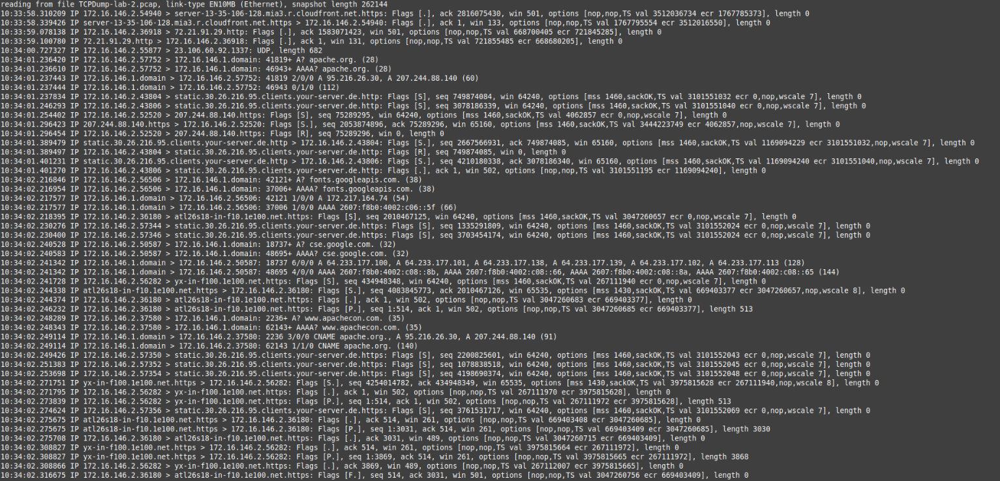

# Network Traffic Analysis Lab

## Objective

The Network Traffic Analysis Lab follows the Hack The Box Academy (HTBA) Introduction to Network Traffic Analysis module and was designed to strengthen both conceptual and practical understanding of computer networking and packet analysis. The primary focus was to examine both pre-existing Packet Capture (PCAP) files and live packet capture data (using both TCPDump and Wireshark) and extract valuable information about current and past network traffic flows, especially as they relate to cybersecurity. The key topics addressed were network security, network attack patterns, and network forensics.

### Skills Learned

- Familiarity with network analysis tools like Wireshark and TCPDump
- Proficiency in analyzing and interpreting network traffic through Pack Captures.
- Ability to discover, isolate, and analyze suspicious network activity.
- Deepened knowledge of network protocols and security vulnerabilities.
- Development of critical thinking and problem-solving skills in cybersecurity.

### Tools Used

- Wireshark and TCPDump for intercepting and scrutinizing network traffic.
- XFreeRDP for remote host communication.

## Steps
The first step in this lab was to analyze a few PCAP files using the command line tool TCPDump, which does not provide a user interface, but outputs network traffic directly into the command line. To use this tool, one requires sudo privileges, as the tool requires direct access to the hardware via the network interfaces. in any case, we first downloaded both TCPDump and Wireshark, which will be used later, to our personal Linux machine. We also downloaded the PCAP file (TCPDump-lab-2.PCAP) from the HTBA website.  
Once the tools required for the initial analysis were all assembled, we tested out the tool by opening the PCAP file using the -r flag:

    tcpdump -r ./TCPDump-lab-2.PCAP

(note, here we do not need sudo privileges, as we are reading a file and do not need access to the system hardware). We were met with the following overwhelming result:

  

  *Ref. 1: An image of the initial PCAP capture outputted via TCPDump*

So the journey had begun. The HTBA module then prompted us to examine the file and look at he types of traffic we might see. We did so, and observed that the first record in the file was from a client machine (using some arbitrarily high port number, 54940) reaching out to a server via HTTPS (port 443). The next line appeared to be a response, so perhaps this was a conversation between a web server and its client. 

A few lines down, we discovered some HTTP traffic (port 80), which is again likely a web server and client, but the traffic in this case was unencrypted. Further still, we were able to se some variation in the traffic, specificlaly noticing the client host in the previous traffic reaching out to a new machine, this time using UDP instead of TCP and utilizing 1337, which was a port not familiar to us at the time. Because 1337 was a mystery, we decided to look this port number, and discovered that one possibility is the Men&Mice DNS service. DNS thus became a possibility. 

After this initial glance at the traffic, the module prompted us to record the hosts involved in the traffic and the ports they utilized. We observed each of the following hosts
        
        172.16.146.2
        172.16.146.1
        server-13-35-106-128.mia3.r.cloudfront.net
        23.196.60.92

using the following ports

        53
        80
        443
        1337

The IP address 172.16.146.2 was acting as the client in the interactions, while the rest of the hosts seemed to be acting as servers. 

Next, we attempted to identify the very first *complete* TCP handshake in the file. To answer this question, it was best to first review what the TCP handshake looks like:

        127.0.0.1.12345 > 127.0.0.1.80:	Flags [S], seq ...
        127.0.0.1.80 > 127.0.0.1.12345:	Flags [S.], seq ...
        127.0.0.1.12345 > 127.0.0.1.80:	Flags [.], seq ...

First, there is the initial packet where one typically has a client reaching out to a server with the SYN flag sent-- [S]. After this, the server responds with both the SYN and ACK flags set-- [S.], indicating, on the one hand, that it has received the client's packet, and on the other, that it would like the client ot synchronizew with its own responses. Finally, the client responds with its own ACK packet-- [.]. 

Because the file was rather long and messy, I used the -s and -c flags, which limit the number of bytes included in each packet and the number of packets included in the cli output, respectively, to clean up the output for this stage of the analysis.

        tcpdump -s 50 -c 50 -r TCPDump-lab-2.PCAP

After analyzing the output, I was able to discern that the first TCP handshake occurs between 172.16.146.2 (as the client) and static.30.26.216.clients.your-server.de (the server).

  

  *Ref. 2: An image of the PCAP capture after reducing the output, including the first TCP handshake*

We were able to determine that static.30.26.216.clients.your-server.de is the server because 172.16.146.2 reaches out first with the SYN packet. As far as I am aware, in almost all cases, it will be the client that initiates the connection to a server. After all, how often does one ever spontaneously receive requests from a webpage enticing us to view its resources? In addition, the port numbers also suggest this client-server configuration. The host with IP address 172.16.146.2 reaches out using an large ephemeral port number, while static.30.26.216.clients.your-server.de utilizes port 443, which is the archetypal port for HTTPS traffic, utilized by servers. As a final piece of evidence, the hostname of the suspected server actally contains the phrase 'your-server' as can be ascertained by visual observation. 

